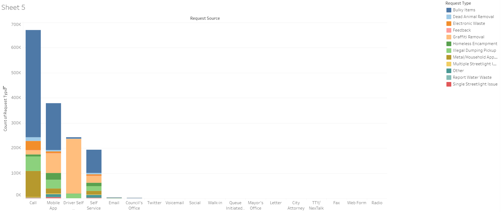
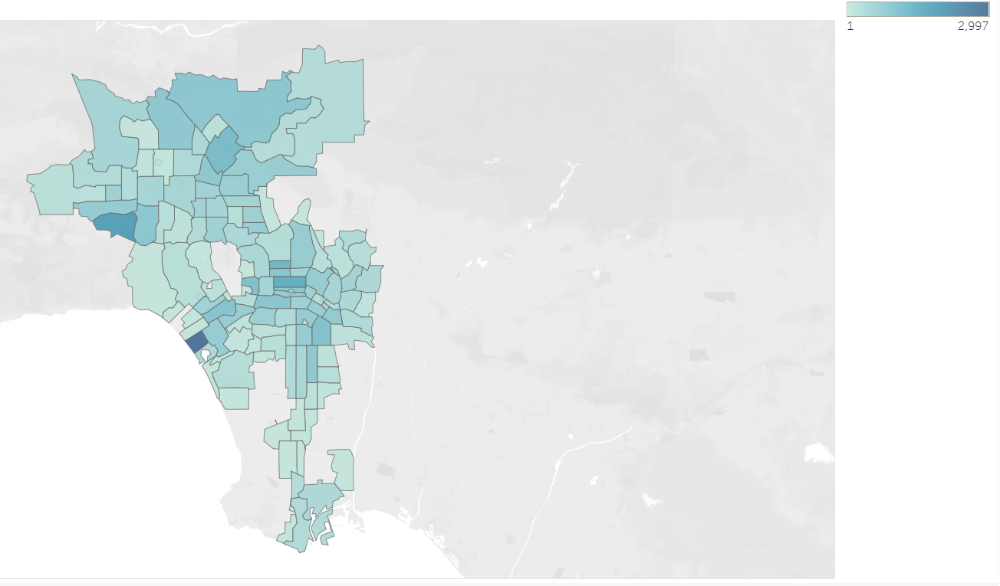
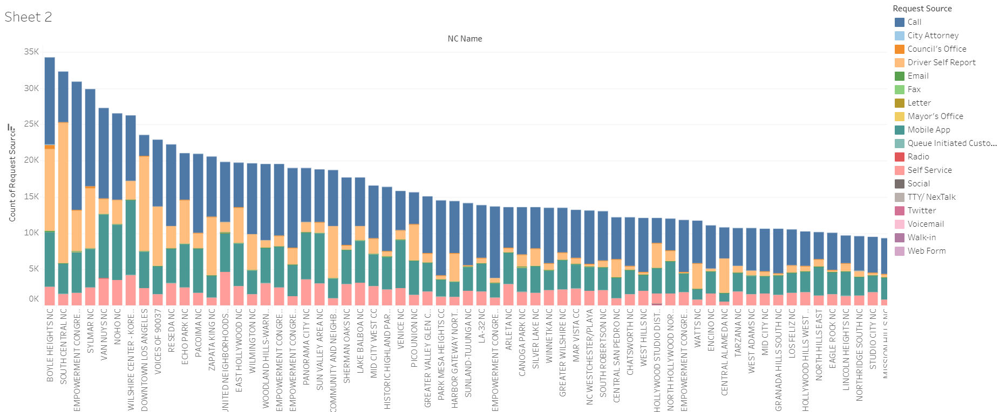

# 311-analysis

## The Data
We have all of the 311 service requests in 2020, totaling 1.4 million. The goal is to identify patterns in the service requests whether it be location, proximity to certain landmarks, time of day, or means of communication (ie. phone vs. email). For context 311, better known as MyLA311, works to connect local Los Angeles residents to City Services quickly and efficiently as well as perform Service Requests intake on behalf of City Departments like taking down grafitti or clean up illegal dumpings. 

I recently startedworking a Tableau Report for this dataset.

https://public.tableau.com/profile/spencer.holley#!/vizhome/Book1_16135680939230/Sheet6?publish=yes

## EDA Questions

1. What is the most common Request Type for each Request Source, as well as overall?

2. Map out the Homeless Encampment removal requests and look for a pattern, are they less concentrated in the San Fernando Valley and Bel Aire / Beverly Crest than the rest of LA?

3. What neighborhood council has the highest number of requests in total, What is the percentage breakdown for request source here?

## Findings
1. Calls, self reports, the mobile app, and self service are the major sources of requests, with the 15 mediums being extremley rare. Calls are the most common with nearly half the requests being calls.

2. The main trend I notice is That the encampments are more concentrated in Southern LA and downtown. While being less concentrated in Santa Monica, Bel Aire, the Pacific Palisades, and the Hollywood Hills are notably less concentrated. This is likley because these areas are more expensive and tend to be higher income. However, the Venice Beach area, 90291 zip code, had the highest number of homeless encampment removal requests at 2,997 throughout 2020!

3. Within the city Boyle Heights had the most requests, with over 2% of the city's requests taking place their. Graffiti Removal was the most poplular request type in this neighborhood, with Bulky Items remaining as a close second.

